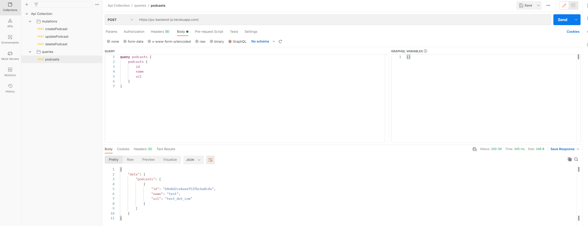
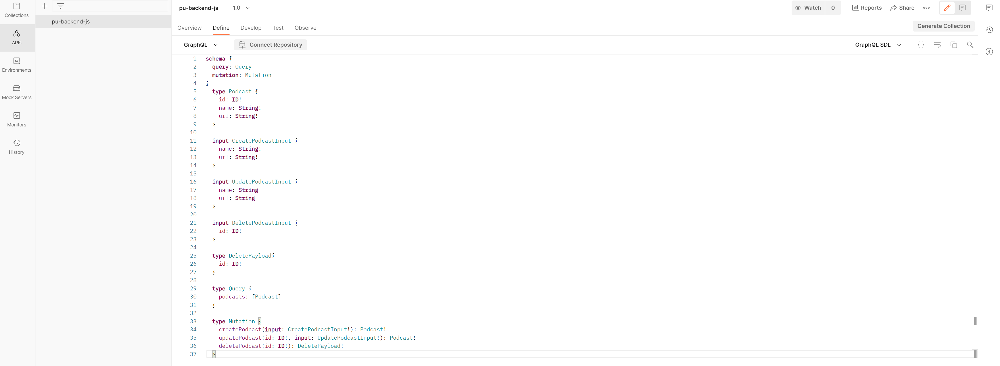

Simple Node JS back end application regarding university project.  
Example creating record locally.  
 
 
Query example locally 
 
Deploying to Heroku using Heroku CLI  
 
Testing query against the deployed application on Heroku using Postman  
 
Create API in Postman with the following schema (can be found in the source code in src/types/Podcast.js)  
 
